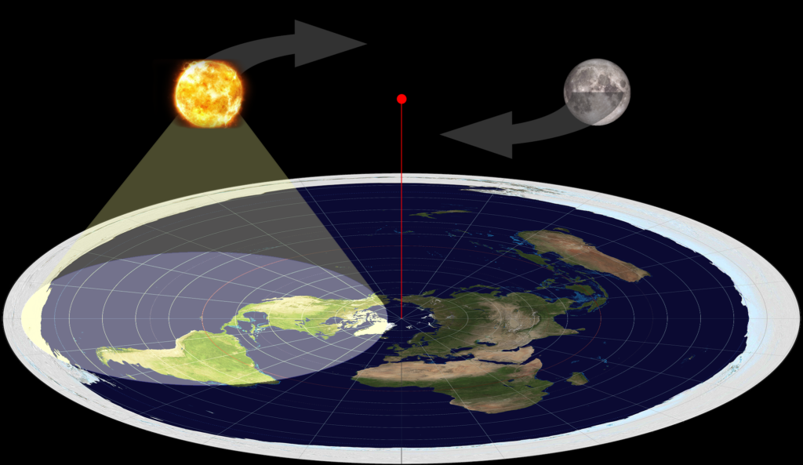
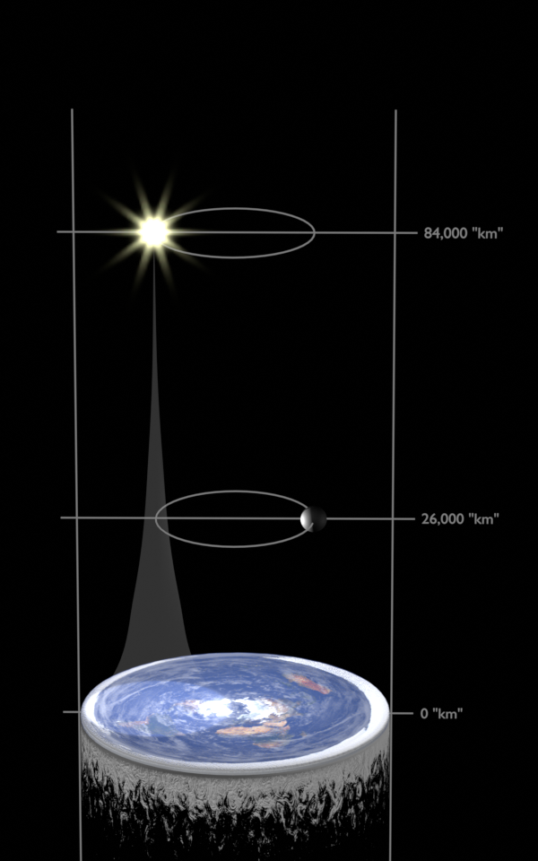

# Actually Correct Flat-Earth Model

Nobody has been able to make a working Flat Earth model, and some even think it's impossible[1](https://www.reddit.com/r/changemyview/comments/1hi10sj/cmv_no_flat_earth_model_is_compatible_with/),[2](https://www.quora.com/Is-there-a-working-model-of-the-flat-Earth-and-where-is-it),[3](https://www.youtube.com/watch?v=tC5RalYWZ5Y). In fact, it is quite simple. Let me show you how it's done.

What everybody is missing is that For the Flat Earth model to work, space-time has to be curved. General relativity folks do it as well, so why can't we.

 
*Figure 1: Naive Flat Earth model ([source](https://biblicalscienceinstitute.com/apologetics/is-the-earth-really-round/))*

## Model Overview

Behold, the correct Flat Earth model:

 
*Figure 2: Correct Flat Earth model*

The fact that everybody was missing is that light rays must bend in a working Flat Earth model.

## Data Sheet

All the distances $r_{round}$ from Earth center are converted into flat earth altitudes $r_{flat}$ based on the following formula:

$$r_{flat}=R \ln {r_{round}\over R},$$

where Earth radius is $R = 6378\,km$.

The size $s_{flat}$ of objects at distance $r_{round}$ is:

$$s_{flat} = s_{round} \cdot {R \over r_{round}}.$$

Data | Value
--- | ---
Earth Diameter | 40,000 "km"
Moon Distance | 26,000 "km"
Moon Diameter | 60 "km"
Astronaut height on the moon | 2.8 "cm"
Sun Distance | 64,000 "km"
Sun Diameter | 60 "km"
Stellar Distances | 150,000 to 200,000 "km"
Dome Distance | 280,000 "km"

## Derivation

Let $(x, y, z)$ be cartesian coordinates of a point, with the origin being the center of the round Earth. Let's introduce spherical coordinates $(e^r,\theta,\phi)$ with the following transformation equations, with $R$ being the Round Earth radius:

$$x=R\,e^r\,\sin\theta\,\cos\phi,$$
$$y=R\,e^r\,\sin\theta\,\sin\phi,$$
$$z=R\,e^r\,\cos\theta.$$

This gives the following line element $ds$:

$$ds^2 = R^2\,e^{2r}(dr^2 + dθ^2 + dϕ^2\sin^2\theta).$$

This shows the reason for choosing an exponential radial component $e^r$: objects are not squished in the $(r,\theta)$ plane. Sun, Moon, stars and even people on Earth remain mostly round. There is nothing we can do about the distortion in $\phi$.

In the $(r,\theta,\phi)$ coordinates, Earth surface is a disc with $r=0$ and $\theta\le\pi$. We would like to work in more intuitive units, so we will introduce the unit "km":

$$"km"={\pi\over20\,000}.$$

With this unit, we can say that the Flat Earth radius is $R_F = 20\,000\;"km"$, and objects $1\;km$ above the Globe Earth surface are $1\;"km"$ above the Flat Earth disc.

## Light Rays

Light rays are curved in the $(r,\theta,\phi)$ coordinates. Without loss of generality, we can explore the path of a light ray $z=z_0,\;y=0$ with a distance from the origin $z_0$. Then,

$$z_0=R\,e^r\,\cos\theta,$$
$$e^r={z_0\over R\cos\theta},$$
$$r=\ln {z_0 \over R} - \ln \cos \theta.$$

In our units, all light rays trace the same shape: $-\ln \cos \theta$, only with an and some $\phi$ weirdness applied.

 
*Figure: Solar light rays.*

## Observations

### Australia Shape

### Eclipses

### Coriolis Forces

### Moon Landings

### Horizon

Objects disappearing behind a horizon can be explained by Earth curved downwards, or equivalently, by light rays curved upwards.

 
Figure: Curved Earth and Flat Earth in curved space can have identical appearance.

# Attributions

* <a href="https://www.flaticon.com/free-icons/yacht" title="yacht icons">Yacht icons created by kerismaker - Flaticon</a>
* <a href="https://www.flaticon.com/free-icons/lighthouse" title="lighthouse icons">Lighthouse icons created by Freepik - Flaticon</a>

# Evidence Package

## subheaders

**bold**, *italic*

Documents | Status | ID | File name
---|---|---|---
546423123 | Signed | text text text
xyz | anrseti | text text text
xyz | anrseti | text text text
xyz | anrseti | text text text
