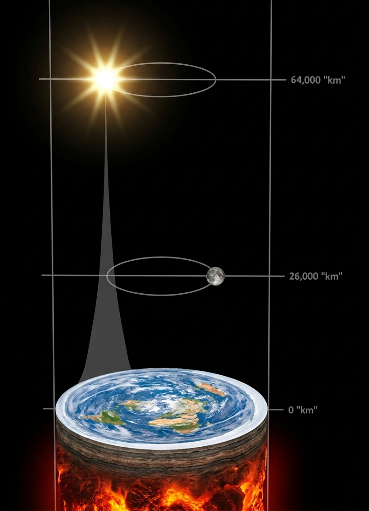
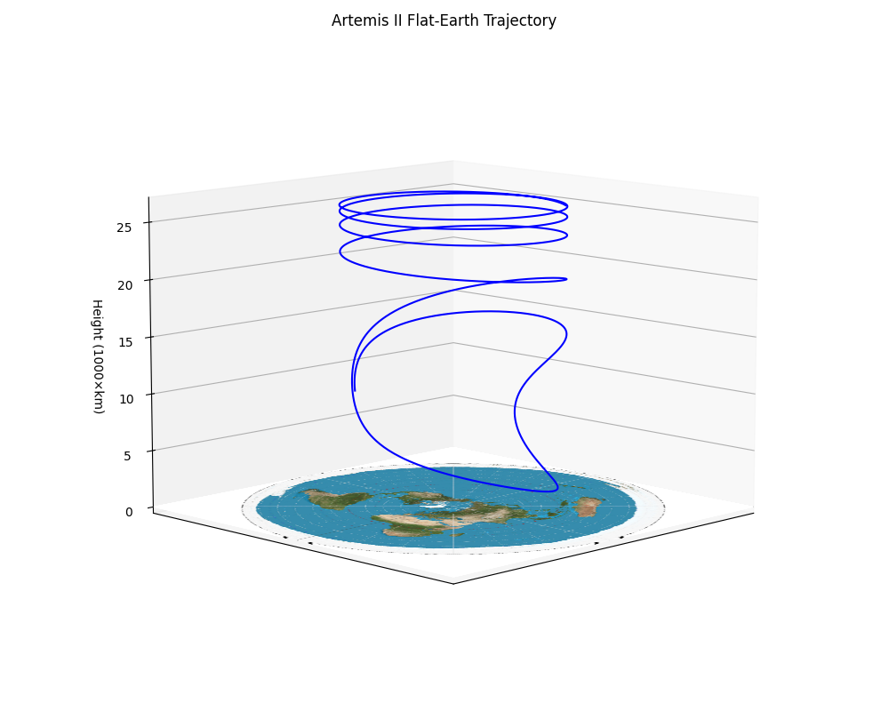
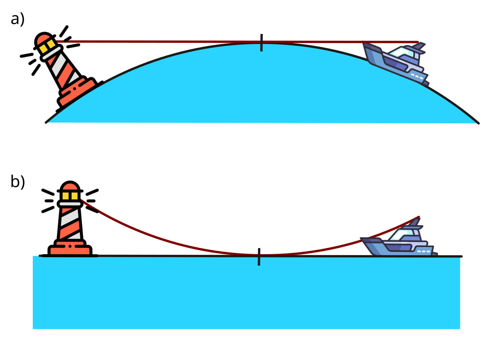
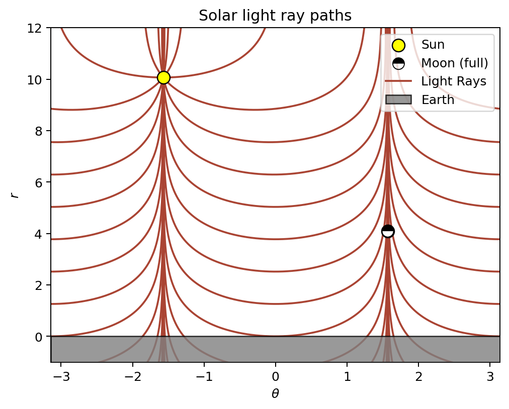

# Actually Correct Flat-Earth Model

[(Original Reddit post)](https://www.reddit.com/r/flatearth/comments/1sey3nh/behold_an_actually_correct_flat_earth_model/)

**Instead of round Earth in flat space, why not have flat Earth in round space?**

It's not even that big of a *stretch* - we live in a curved space-time anyways. And thanks to Einstein, all physics work in curved space-times just fine.

I plotted the Artemis trajectory as a "proof" that I am not just making it up (Figure 2).

TL;DR: It is silly, just an exercise in weird maths, but it works. It's just a coordinate transformation of normal space to spherical coordinates with a logarithmic radial dimension.  Get a friendly physicist to explain it, if you don't trust me 😀

Some features:

- The Universe is a tall cylinder (Figure 1)
- Earth is the only flat celestial object. Other stars/planets are ellipsoids.
- Sun and moon are the same size: about 60km wide.
- Things shrink when they travel upwards. Astronauts on the Moon would be just around 3cm tall.  
- Stars are 3 times further than the Sun and reaaally tiny (as they should).  
- If you went to Australia, you would be elongated. If you stood on the South pole, you would wrap around the whole disc.  
- At the edge, there is a singularity. But space can also be extended beyond the edge to repeat itself (see Figure 3).  
- Ships still disappear below horizons. It's not because Earth curves down, but because light curves up (Figure 4). The result is the same.

 
*Figure 1: Flat Earth Model, aka Cylindrical Universe Model*

 
*Figure 2: Artemis II Trajectory on Flat Earth*

 
*Figure 3: Endless Flat Earth*

 
*Figure 4: Boat on Flat Earth*

## Data Sheet

Data | Value
--- | ---
Earth Diameter | 40,000 "km"
Moon Distance | 26,000 "km"
Moon Diameter | 60 "km"
Astronaut height on the moon | 2.8 "cm"
Sun Distance | 64,000 "km"
Sun Diameter | 60 "km"
Stellar Distances | 150,000 to 200,000 "km"
Dome Distance | 280,000 "km"
Dome Material | Big Bang 🤯

### Formulas used for the datasheet

All the distances $r_{round}$ from Earth center are converted into flat earth altitudes $r_{flat}$ based on the following formula:

$$r_{flat}=R \ln {r_{round}\over R},$$

where Earth radius is $R = 6378\,km$.

The size $s_{flat}$ of objects at distance $r_{round}$ is:

$$s_{flat} = s_{round} \cdot {R \over r_{round}}.$$

# Derivation

Nobody has been able to make a working Flat Earth model, and some even think it's impossible[1](https://www.reddit.com/r/changemyview/comments/1hi10sj/cmv_no_flat_earth_model_is_compatible_with/),[2](https://www.quora.com/Is-there-a-working-model-of-the-flat-Earth-and-where-is-it),[3](https://www.youtube.com/watch?v=tC5RalYWZ5Y). In fact, it is quite simple. Let me show you how it's done. What everybody is missing is that For the Flat Earth model to work, space-time has to be curved. General relativity folks do it as well, so why can't we.

Let $(x, y, z)$ be cartesian coordinates of a point, with the origin being the center of the round Earth. Let's introduce spherical coordinates $(e^r,\theta,\phi)$ with the following transformation equations, with $R$ being the Round Earth radius:

$$x=R\,e^r \sin\theta \cos\phi,$$
$$y=R\,e^r \sin\theta \sin\phi,$$
$$z=R\,e^r \cos\theta.$$

This gives the following line element $ds$:

$$ds^2 = R^2 e^{2r}(dr^2 + dθ^2 + dϕ^2\sin^2\theta).$$

This shows the reason for choosing an exponential radial component $e^r$: objects are not squished in the $(r,\theta)$ plane, at any altitude. Sun, Moon, stars and even people on Earth remain mostly round. There is nothing we can do about the distortion in $\phi$.

In the $(r,\theta,\phi)$ coordinates, Earth surface is a disc with $r=0$ and $\theta\le\pi$. We would like to work in more intuitive units, so we will introduce the unit "km":

$$"km"={\pi\over20 000}.$$

With this unit, we can say that the Flat Earth radius is $R_F = 20 000 "km"$, and objects $1 km$ above the Globe Earth surface are $1 "km"$ above the Flat Earth disc.

## Light Rays

Light rays are curved in the $(r,\theta,\phi)$ coordinates. Without loss of generality, we can explore the path of a light ray $z=z_0, y=0$ with a distance from the origin $z_0$. Then,

$$z_0=R e^r \cos\theta,$$
$$e^r={z_0\over R\cos\theta},$$
$$r=\ln {z_0 \over R} - \ln \cos \theta.$$

In our units, all light rays trace the same shape: $-\ln \cos \theta$ (disregarding $\phi$ for the moment).

 
*Figure: Solar light rays. This image shows full moon, and also the lunar eclipse. The positions of celestial bodies in those two cases is nearly identical.*

### Observations

## Horizon

Objects disappearing behind a horizon can be explained by Earth curved downwards, or equivalently, by light rays curved upwards.

 
Figure: Curved Earth and Flat Earth in curved space can have identical appearance.

### Flight paths

In Southern hemisphere, the Earth is stretched. But the plane is also stretched, so it compensates and everything works out.

### Coriolis Forces

If we want to replicate Coriolis forces and other effects caused by the fact that our frame of reference is non-inertial, we  need curved _space-time_. Curved _space_ alone will not do it. The metric will be quite hard to figure out, though.

### Moon Landings

Astronauts get really tiny when they travel to the moon. Conveniently, they are not unlike the size of a lego man, ~3cm tall. 

Figure 2 shows the Artemis II trajectory on Flat Earth. Because Moon orbits the flat Earth quite fast - once every 25 hours - the Orion spacecraft needs to catch up to its speed in a wild spiral.

# Attributions

* <a href="https://www.flaticon.com/free-icons/yacht" title="yacht icons">Yacht icons created by kerismaker - Flaticon</a>
* <a href="https://www.flaticon.com/free-icons/lighthouse" title="lighthouse icons">Lighthouse icons created by Freepik - Flaticon</a>
